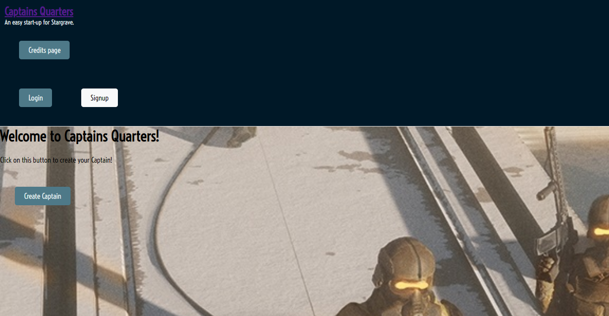
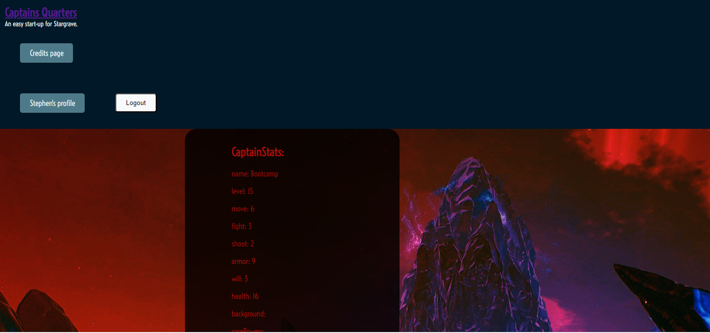

# Captain's Quarters - A Captain Creation App for Stargrave Miniatures Game
## Description
The purpose of this app is to give new players of the Stargrave miniatures game a place to make a new character (captain) to play the game, without needing to own the core rulebook for the game.  The completed captain could then be viewed on the player's device to reference while playing the game.
## User Story
AS A new player of the Stargrave game, I want to be able to quickly make a new Captain to play with, without need for a rulebook
## Acceptance Criteria
IT IS DONE when a user can create an account or login and can go through the steps to make a captain, then have that completed captain ready to view during play.
## Technology Used
This app uses MongoDB, REACT, NodeJS, ExpressJS, Mongoose, BCrypt, and JWT
## Screenshots

## Heroku Deployed Link
